## Which sites in the SARS-CoV-2 genome may be under selection and which ones might merit a closer look?

There are a fair number of sites (positions) in most SARS-CoV-2 genes that show some _statistical_ evidence of [positive selection](https://en.wikipedia.org/wiki/Disruptive_selection) (for more details and to explore the data see [the Interactive ObservableHQ Notebook](https://observablehq.com/@spond/natural-selection-analysis-of-sars-cov-2-covid-19)). You can see the up-to-date list in the table at the bottom of the page. 

It is important to realize, that just because a site is showing a pattern consistent with diversifying selection does not mean that mutations at that site are going to change the fitness of the virus (in fact we expect most of them [to be insignificant](https://academic.oup.com/mbe/article/35/6/1348/4983910)). A reasonable approach to find a small set of sites that are worth looking at because they *might* have a phenotypic effect on the virus should have this set of properties

1. Statistical test for selection is significant at a site. 

**and one or more of the following**

1. The mutation(s) emerged only recently; if the mutation was present in early infection it's likely just random evolutionary noise. 
2. The mutation is present in more than one isolate, or isolates from the same batch of sequencing runs; otherwise it could just be a sequencing error. 
3. The mutation is increasing in frequency (which might indicate directional selection), or occurs multiple times in different lineages (recurrence consistent with evolutionary selective pressure exerted by the the hosts)
4. There's previous literature on functional importance of this site, or evidence that evolutionary changes at this site had phenotypic effects on related coronaviruses. 

To put this into context, consider the following examples of sites that I would **not** consider priority candidates for further exploration even though they all meet the statistical significance criterion test.

### Site 298 in S (E298S) - a "blip"

This site only occurs in a two sequences from the same location, does not increase in frequency over time, and involves a double-nucleotide change, which are rare events and could sometimes result [false positives](https://www.ncbi.nlm.nih.gov/pubmed/29967485)

| Temporal Trend | Placement in tree |
|:--:|:--:|
|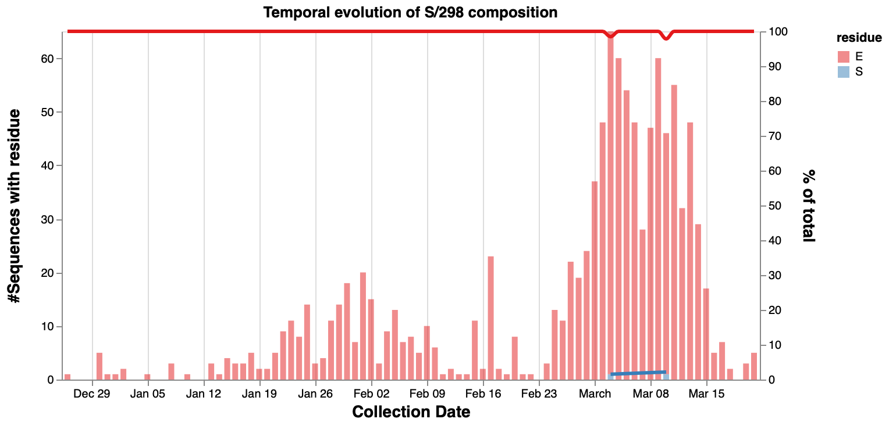|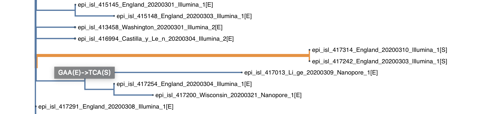|

>**What may change my mind?** Collecting more sequences with the same variant from different locations, especially if one can be found that "bridges" the E → S substitution via a one-nucleotide change. 

### Site 54 in ORF3a (Q54H) - an "early variant"

The `H` variant at this position has been present since early in the epidemic and is localized to a single clade in the gene tree, and it is also a 2-nucleotide change. The default assumption this is one of many "neutral" variants that arose in early stages of the pandemic. These variants may turn out to be important, but more data collection is needed.
 
>**What may change my mind?** Increase in frequency, multiple clades in the tree.
>
| Temporal Trend | Placement in tree |
|:--:|:--:|
|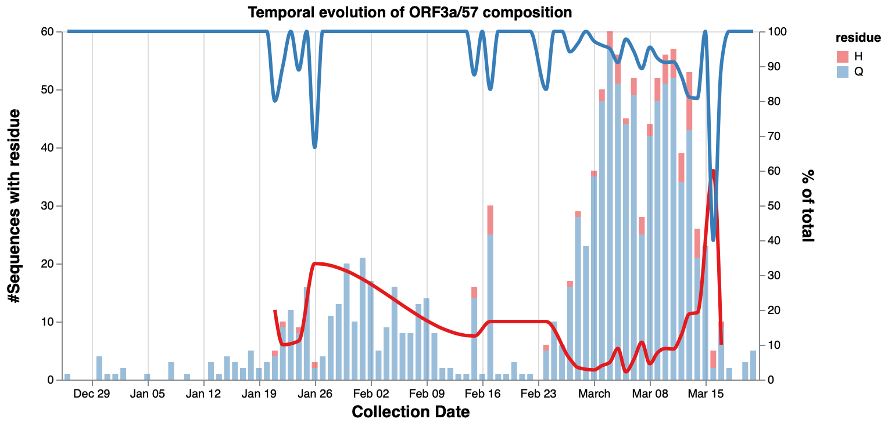|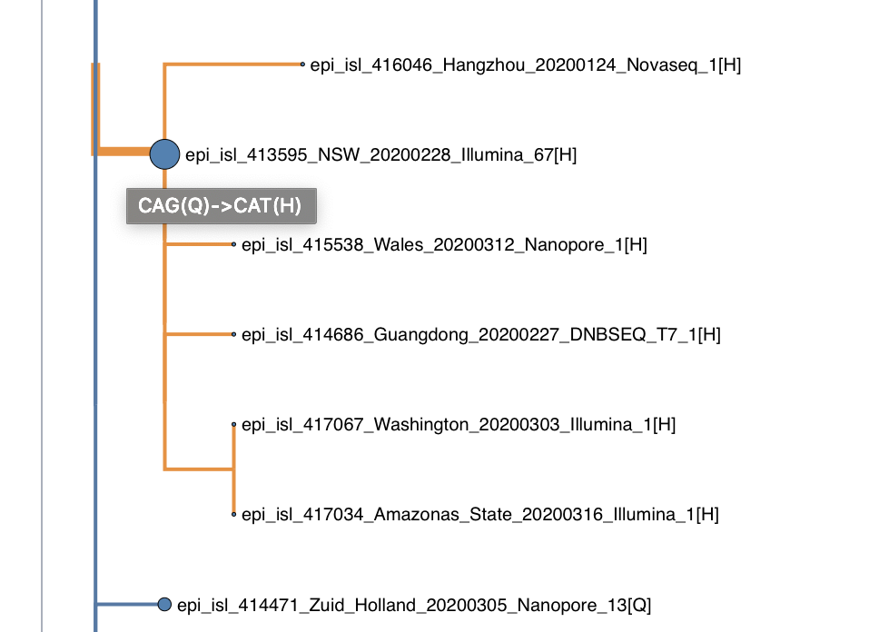|

---

Here are some sites that could be worth looking at in more detail.

### Site 265 in ORF1a (T265I, nsp2 T85I)

The minor residue (`I`) appears fairly late, and is independently derived several times in the tree (potentially multiple independent evolutionary events). The substitution is also realized by changing a single nucleotide, `T` and `I` are biochemically quite dissimilar, and mutations in `nsp2` have [recently been associated](https://onlinelibrary.wiley.com/doi/full/10.1002/jmv.25719) with structural and possible phenotypic changes. 

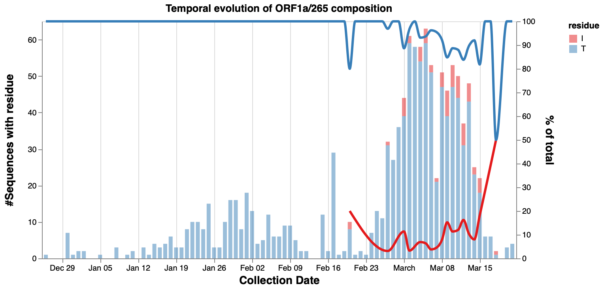

| Tree Part 1 | Tree Part 2|
|:--:|:--:|
|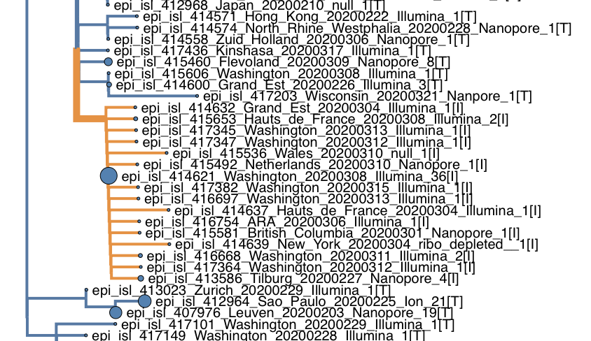|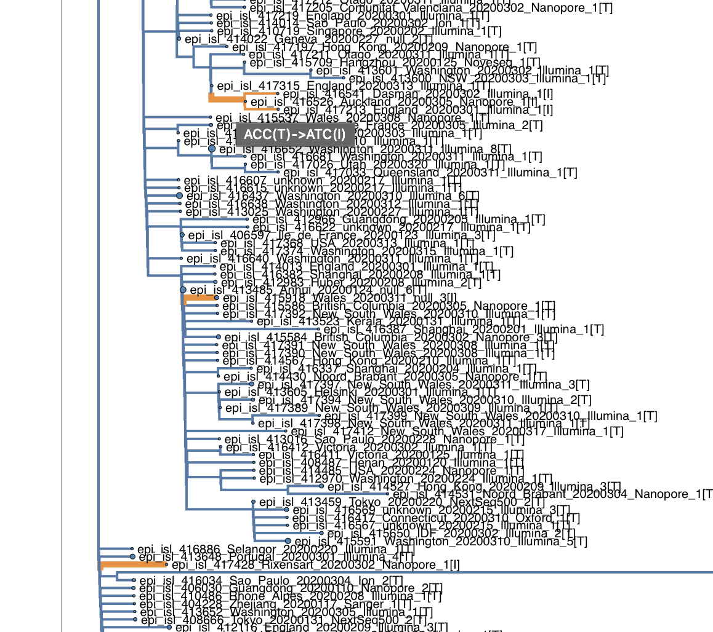|

### Site 313 in ORF1b (P313L, nsp13 P504L)

The minor residue (`L`) appears quite early but is increasing in frequency, and is independently derived several times in the tree (potentially multiple independent evolutionary events). The substitution is also realized by changing a single nucleotide.

| Temporal Trend | Placement in tree |
|:--:|:--:|
|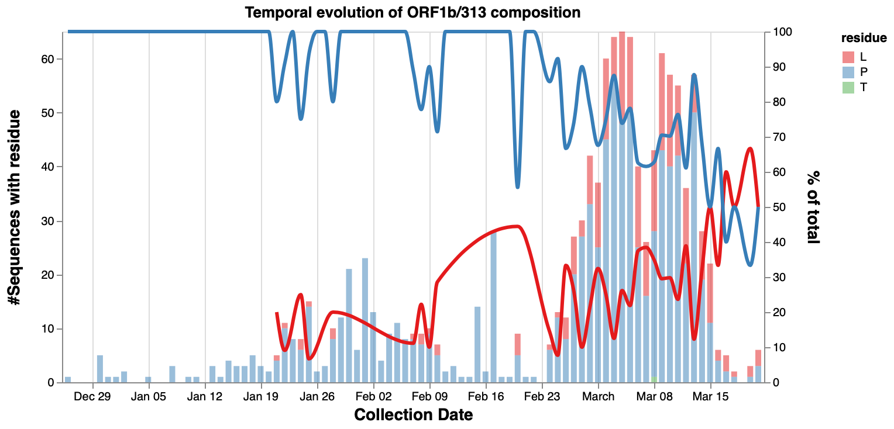|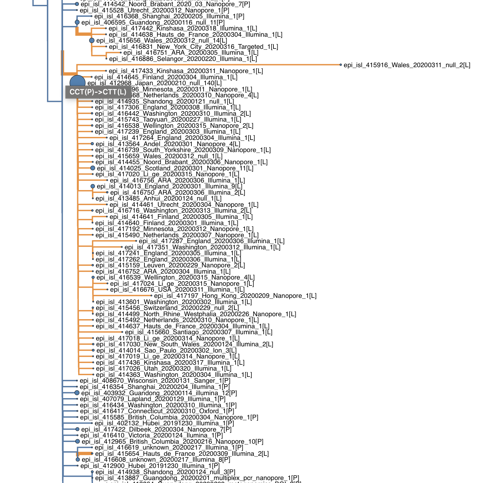|

### Site 943 in S (S943P/T)

This site is interesting because we have sequences that represent a sequence of mutations from the ancestral residue (S → T → P), which is what makes it different from other blips. These sequences are also from different locations (multiple locations in Netherlands and Wales), and we can also say something about evolutionary conservation/alteration of biochemical properties (purely based substitution models): polarity is conserved, while the effect on secondary structure is altered. 

| Temporal Trend | Placement in tree |
|:--:|:--:|
|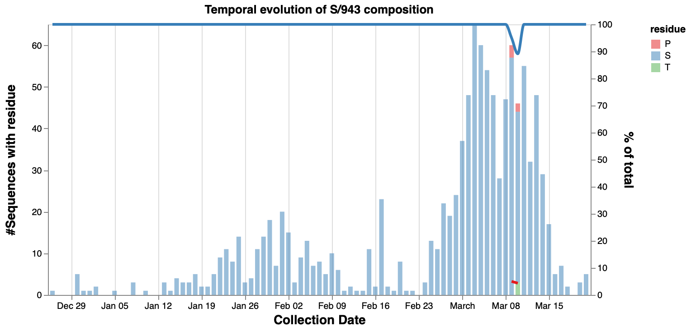|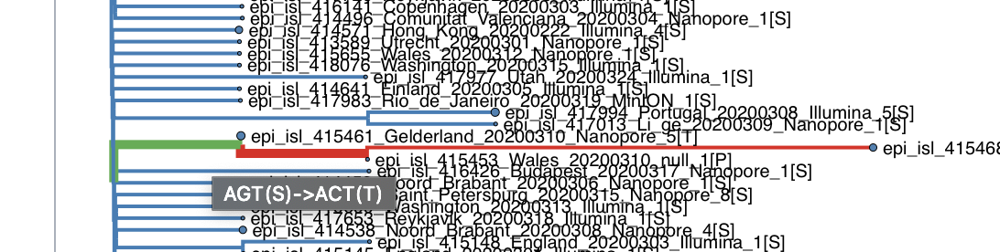|

### Negatively selected sites (e.g. ORF1a/83)

Negative selection at variable sites could indicate functional constraint and might be useful for [drug target or vaccine design considerations](https://www.ncbi.nlm.nih.gov/pubmed/17508277)

---

#### An up-to-date table of residues passing statistical significance tests for positive or negative selection.

@import "@styles/_variables.sass

