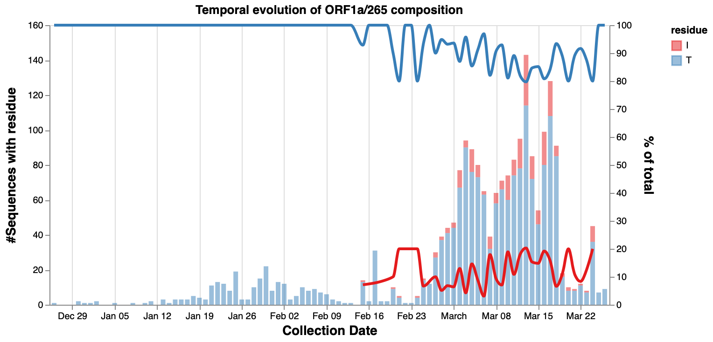
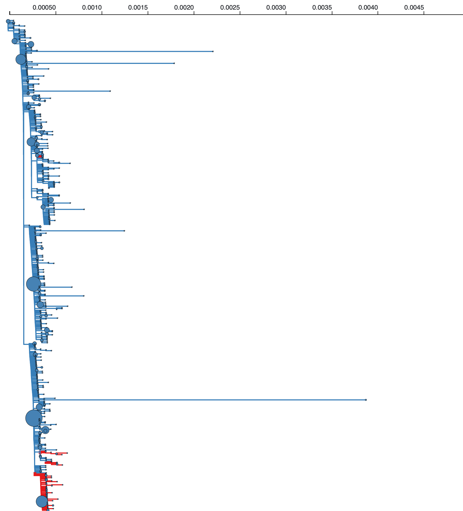

## Which sites in the SARS-CoV-2 genome may be under selection and  might merit a closer look after a week of analyses?

1). The list of **interesting** sites that may be subject to positive selection is below. As always, thanks to  and all sequence submitters!

#### S D614G

This variant is present early in infection, but there now appear to be multiple **reversions** from G to D (at least two separate events). It first reached statistical significance in our testing on Mar 30th. This "toggling" behavior has been [associated](https://journals.plos.org/plospathogens/article?id=10.1371/journal.ppat.1000242) with immune selective pressure in HIV-1 in the context of cellular immune response; the breadth and significance of CTL response for SARS-CoV-2 is not currently well described, but some work in this area is being done ([1](https://www.medrxiv.org/content/10.1101/2020.03.22.20040600v1), [2](https://www.biorxiv.org/content/10.1101/2020.03.23.004176v1)). The wildtype 9-mer around this position (`YQDVNCTEV`) is [predicted](http://tools.iedb.org/tepitool/) to be a high rank binder to `HLA-A*02:06` whereas a mutant allele (`YQGVNCTEV`) is **not**. This allele has a [relatively high frequency in Chinese Han populations](http://www.allelefrequencies.net/hla6002a.asp?all_name=A*02%3A06) and much lower frequencies in many European populations. 

|Temporal trends at S614|Placement of clades with variants in ML tree|
|:---:|:---:|
| | |

#### ORF3a Q57H

This position was first detected on March 26th. While the data are noisy, it does appear that the frequency of Q at this position has an upward trend, and there are *two* separate introduction of Q in the tree (albeit one of them only has a single sequence). One of the reasons this position is interesting is that there are three datasets with deep sequencing data (that allows one to look for intra-host variation) which have detectable population mixture at that site (see [http://covid19.galaxyproject.org](http://covid19.galaxyproject.org), implying that there may be measurable intra-host selective pressures at that site; there is [evidence, including for ORF3a](https://academic.oup.com/cid/advance-article/doi/10.1093/cid/ciaa203/5780800), of intra-host variability of SARS-CoV-2 population. [A prepint](https://doi.org/10.1101/2020.03.27.012013) looking at variation in ORF3a predicted a deleterious effect of this substitution, altough its fitness effect remains unknown.

|Temporal trends at ORF3a 57|Placement of clades with variants in ML tree|
|:---:|:---:|
| | |

#### ORF8 84L/S

This position was first detected on March 25th, and while it's an early variant (not obvious what the ancestral residue was, but the oldest sequence has an `S`, there are three indepdendent introductions on this (admittedly poorly resolved) gene tree. Like S614, this site may be an example of toggling behvaior, althogh binding predictions for both variants of the HLA epitope show similarly high binding predictions for HLA-A\*23:01 and HLA-A\*24:02

|Temporal trends at ORF3a 57|Placement of clades with variants in ML tree|
|:---:|:---:|
| | |

#### ORF1a T265I (nsp2 T85I)

This position was first detected on March 25th. It is the only position on out list that does not appear in sampled sequences until mid-Februray, and has 4 introductions in the ML tree, without any examples of reversions. Potenital functional significance of this substitution is unclear. There is [a report of a deletion](https://www.biorxiv.org/content/10.1101/2020.03.19.998179v1.abstract) in `nsp2` (at position 268).

|Temporal trends at ORF1a T265I |Placement of clades with variants in ML tree|
|:---:|:---:|
| | |

#### ORF1a L960F (nsp3 L142F)

This position was first detected on March 26th. The `F` variant apepars late and is at low frequency, but has multiple introductions in the tree (although only one on an internal branch).

|Temporal trends at ORF1a L960F |Placement of clades with variants in ML tree|
|:---:|:---:|
| | |

#### ORF1a L3606F (nsp6 L37F)

This position was first detected on March 30th. There are *three* separate introduction of F in the tree that occur along internal tree branches. There are **three** datasets with deep sequencing data which have detectable population mixture at that site (see [http://covid19.galaxyproject.org](http://covid19.galaxyproject.org).

|Temporal trends at ORF1a L3606F |Placement of clades with variants in ML tree|
|:---:|:---:|
| | |

#### ORF1b T1729I (exonuclease T206I)

This position was first detected on March 25th. The `I` variant apepars late and is at low frequency, but has multiple introductions in the tree (although only one on an internal branch).

|Temporal trends at ORF1b T1729I |Placement of clades with variants in ML tree|
|:---:|:---:|
| | |

2). After a week of analyses (Mar 25 - Apr 1) during which the number of sequences in  about tripled from ~1000 sequences to over ~3200 sequences we found that the number of sites which show variants increases about linearly. The number of sites that show statistical signal for selection (the eight interesting sites are described above) grew from 25 to 46.

#### An up-to-date table of residues passing statistical significance tests for positive or negative selection.

@import "@styles/_variables.sass

